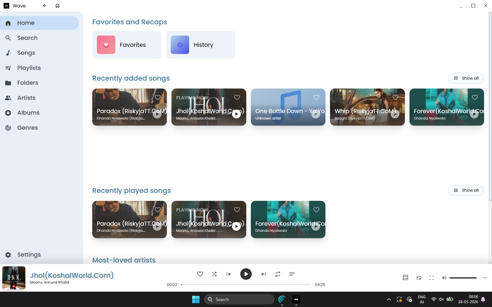
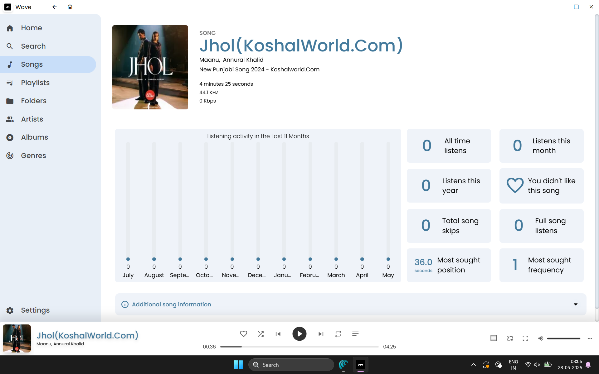
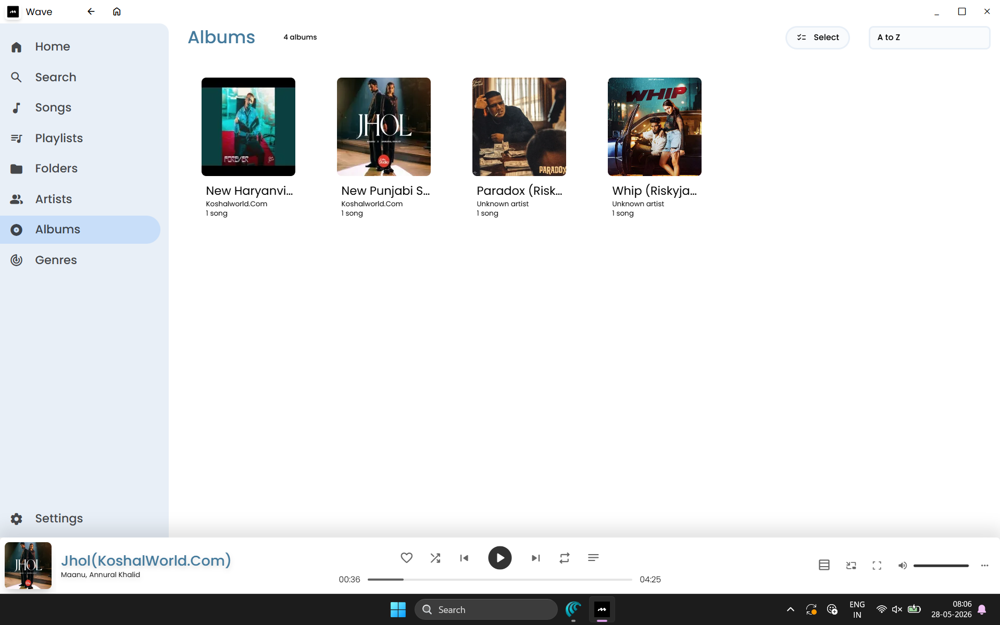
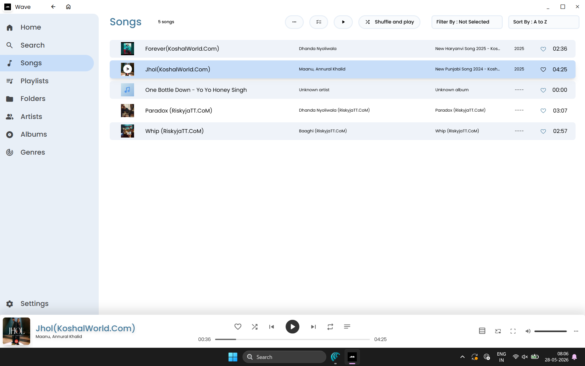
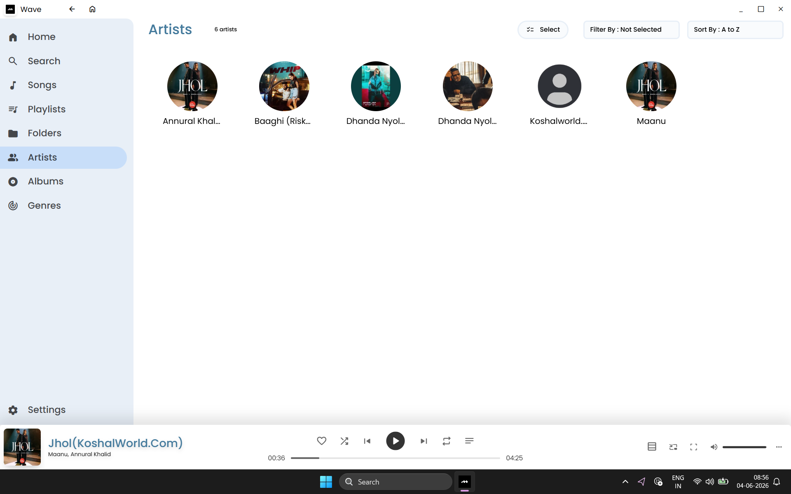
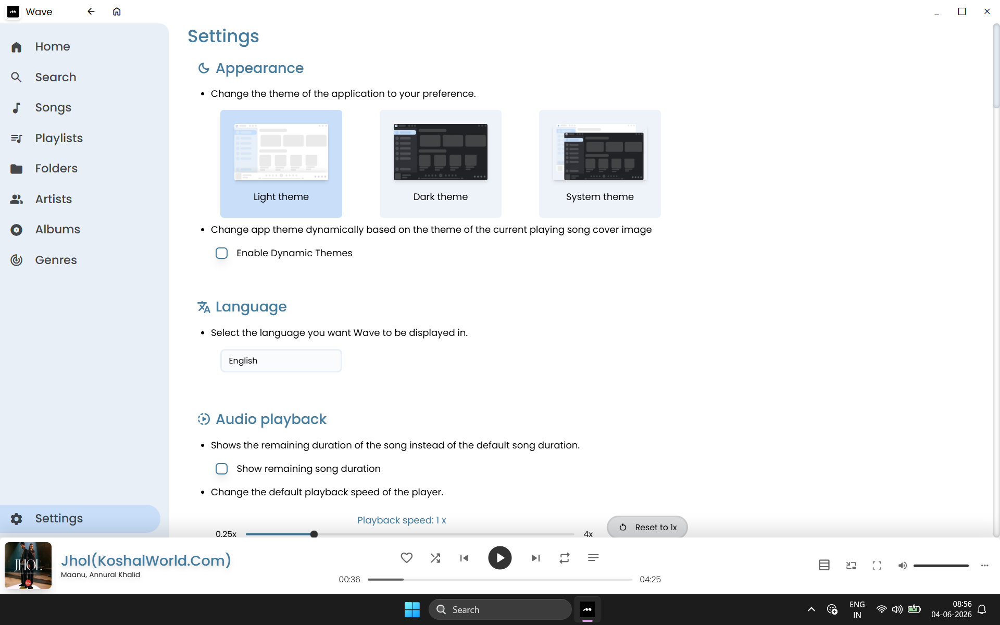
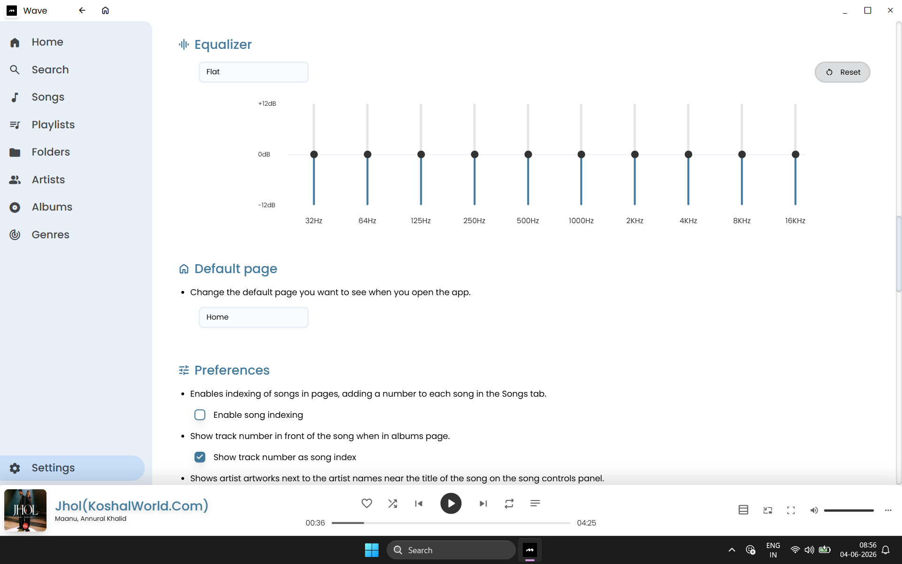

# 🎵 Wave Music

### *An Elegant Desktop Music Player — Reimagined*

**Experience your local music library like never before.**

&nbsp;&nbsp;

&nbsp;&nbsp;

---

[📥 Download](#-download) &nbsp;•&nbsp; [✨ Features](#-features) &nbsp;•&nbsp; [📸 Screenshots](#-screenshots) &nbsp;•&nbsp; [⚙️ Tech Stack](#%EF%B8%8F-tech-stack) &nbsp;•&nbsp; [👨‍💻 Developer](#-developer)

---

## 🌊 About Wave Music

**Wave Music** is a premium, modern desktop music player built for users who care about design and experience. It goes beyond just playing audio — Wave organizes your entire music library into **songs, artists, albums, playlists, folders, and genres**, while offering features like **synced lyrics, listening analytics, a 10-band equalizer, dynamic theming**, and much more.

Whether you're a casual listener or a music enthusiast, Wave delivers a **polished, distraction-free listening experience** that puts your music front and center.

---

## 📥 Download

> **One-click download — No installation hassle.**

### 🖥️ Windows

> [!NOTE]
> After the repository is live, the `Wave.exe` file will be available under **[Releases](https://github.com/rahulloyal/Wave-Music/releases)**. Simply click the download button above or head to the releases page.

---

## ✨ Features

### 🏠 Smart Home Dashboard
- **Favorites & Recaps** — Instantly access your loved songs and listening history
- **Recently Added Songs** — New additions are always front and center
- **Recently Played** — Pick up right where you left off
- **Most-Loved Artists** — Your top artists, always within reach

### 🎵 Library Management
- **Songs** — Browse your complete library with metadata (artist, album, year, duration)
- **Albums** — Beautiful album art grid with cover thumbnails
- **Artists** — Circular artist portraits with automatic artwork detection
- **Playlists** — Create and manage custom playlists
- **Folders** — Browse by file system structure
- **Genres** — Auto-categorized genre browsing

### 🎤 Song Details & Analytics
- **Detailed Song Info** — View bitrate, sample rate, duration, and album art
- **Listening Activity** — Monthly listening history graph
- **Play Statistics** — All time listens, monthly listens, full listens, song skips
- **Most Sought Position** — See which part of the song you play most
- **Additional Metadata** — Complete song information at your fingertips

### 🎛️ Audio Experience
- **10-Band Equalizer** — Fine-tune your sound with presets (Flat, Rock, Pop, etc.)
- **Playback Speed Control** — Adjust from 0.25x to 4x speed
- **Shuffle & Repeat** — Standard playback controls with queue management
- **Volume Control** — Precise volume slider with mute toggle

### 🎨 Appearance & Themes
- **Light Theme** — Clean, bright interface for daytime use
- **Dark Theme** — Easy on the eyes for nighttime sessions
- **System Theme** — Automatically match your OS appearance
- **Dynamic Themes** — App colors change based on the currently playing song's artwork

### 🌐 Language & Localization
- **Multi-language Support** — Interface available in multiple languages
- **Synced Lyrics** — Sing along with time-synchronized lyrics
- **Last.FM Scrobbling** — Track and share your listening habits

### 🔍 Search & Discovery
- **Advanced Search** — Smart filters to find any song, artist, or album
- **Sort & Filter** — Organize by name (A to Z), date, artist, and more
- **Select Mode** — Batch select songs for bulk operations

### 💻 Player Controls
- **Now Playing Bar** — Persistent playback controls at the bottom
- **Song Progress** — Precise seek bar with time tracking
- **Mini Player** — Compact view for distraction-free listening
- **Queue Management** — View and manage your upcoming tracks

---

## 📸 Screenshots

### 🏠 Home Screen

  

### 🎵 Song Details & Analytics

  

### 💿 Albums View

  

### 🎶 Songs List

  

### 🎤 Artists View

  

### ⚙️ Settings — Appearance & Themes

  

### 🎛️ Settings — Equalizer & Preferences

---

## ⚙️ Tech Stack

Wave Music is built with a cutting-edge technology stack for maximum performance and a native-like experience:

| Layer | Technology |
|---|---|
| **Framework** | [Electron](https://www.electronjs.org/) — Cross-platform desktop runtime |
| **Frontend** | [React 19](https://react.dev/) — Component-based UI library |
| **Language** | [TypeScript](https://www.typescriptlang.org/) — Type-safe JavaScript |
| **Build Tool** | [Vite](https://vitejs.dev/) + [electron-vite](https://electron-vite.org/) — Lightning-fast HMR & builds |
| **Styling** | [Tailwind CSS 4](https://tailwindcss.com/) — Utility-first CSS framework |
| **Routing** | [TanStack Router](https://tanstack.com/router) — Type-safe file-based routing |
| **State & Data** | [TanStack Query](https://tanstack.com/query) — Async state management |
| **Database** | [PGlite](https://electric-sql.com/product/pglite) + [Drizzle ORM](https://orm.drizzle.team/) — Embedded PostgreSQL |
| **Linting** | [Oxlint](https://oxc.rs/) — Blazing-fast Rust-based linter |
| **Formatting** | [Oxfmt](https://oxc.rs/) — High-performance code formatter |
| **Image Processing** | [Sharp](https://sharp.pixelplumbing.com/) — High-performance image manipulation |
| **Lyrics** | [SongLyrics](https://www.npmjs.com/package/songlyrics) — Online & offline lyrics |
| **Internationalization** | [i18next](https://www.i18next.com/) — Multi-language support |
| **Installer** | [electron-builder](https://www.electron.build/) — NSIS-based Windows installer |

### 🎧 Supported Audio Formats

| Format | Extension |
|---|---|
| MP3 | `.mp3` |
| WAV | `.wav` |
| OGG Vorbis | `.ogg` |
| AAC | `.aac` |
| FLAC | `.flac` |
| OPUS | `.opus` |
| M4A | `.m4a` |
| M4R | `.m4r` |

---

## 👨‍💻 Developer

### Developed by **Rahul Loyal Dalmas**

*Powered by* **Shruhh.inc**

 

&nbsp;&nbsp;

&nbsp;&nbsp;

---

## 📄 License

This project is proprietary software developed by **Rahul Loyal Dalmas** under **Shruhh.inc**.

All rights reserved © 2024-2026 Shruhh.inc

---

**Made with ❤️ by Rahul Loyal Dalmas**

*Wave Music — Feel the Rhythm, Ride the Wave* 🌊

